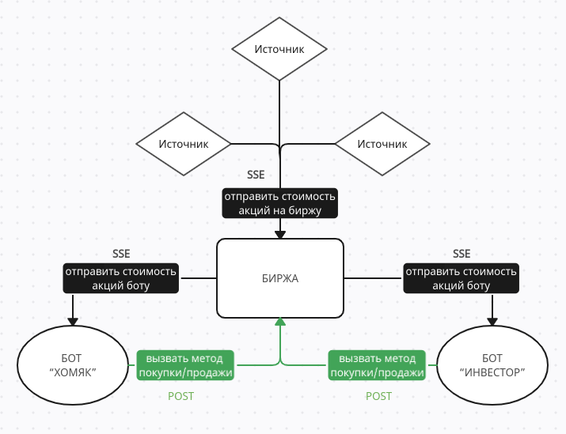
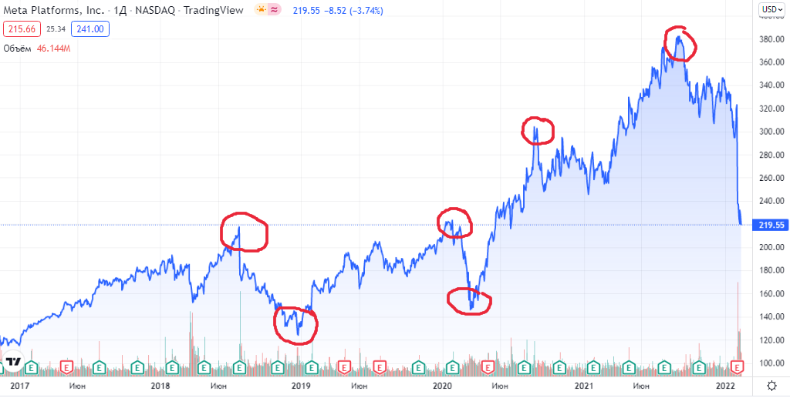
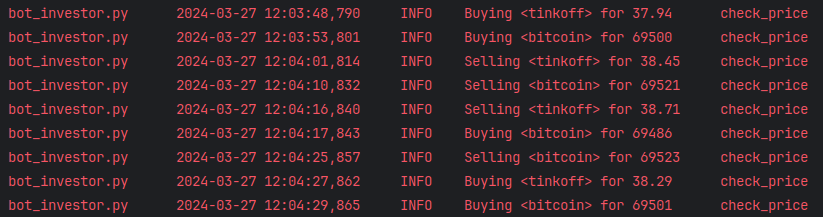
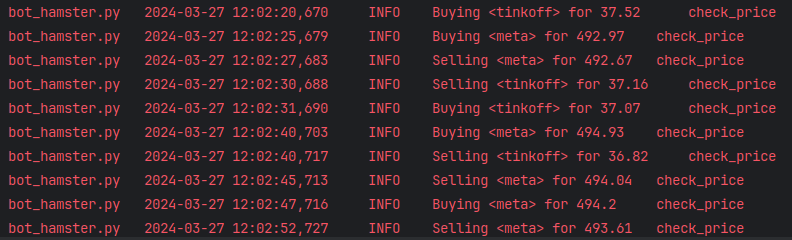

# Биржа с блэкджеком и плюшками (SSE)

---

Так выглядит простенькая диаграмма взаимодействия сервисов, которую я накалякал перед тем, как начал страдать... 



> [!NOTE]  
> Запуск сервисов в конце

Нет, ладно, разработка сервисов шла неплохо. Начал с источников - каждый торгует разным активом, которых всего 3:
* Bitcoin
* Tinkoff
* Meta*    

(*запрещенная на территории РФ организация)

Биржа получает "ивенты" со всех источников, как sse-client, сохраняет их в переменной и в роли sse-server готова отправлять информацию участникам биржи, т.е. ботам

Боты в свою очередь коннектятся к бирже как sse-client, получают информацию о всех активах, парсят и выбирают нужные (указанные в `INTERESTED_IN`).

Алгоритм покупки/продажи незамысловатый. Я храню максимальную цену покупки  и только 3 последние стоимости актива, т.к. меня интересуют лишь вот эти "пики" или "просадки"



Соответственно и источники генерируют не просто рандомные числа. Цена сначала понижается и с шансом 15% меняет направление для получения тех самых "пиков"
```python
cur_price = round(cur_price - random.randint(0, 10)*up_down, 2)
if random.choices([True, False], [0.15, 0.85])[0]:
    up_down = -up_down
```

Так выглядит код бота инвестора. У бота хомяка просто наоборот

```python
if prices[0] < prices[1] > prices[2] and 0 < bought_price[stock] < prices[2]:
    logger.info(f"Selling <{stock}> for {prices[2]}")
    bought_price[stock] = 0
    send_to_market('http://localhost:8080/sell', stock)
elif prices[0] > prices[1] < prices[2]:
    bought_price[stock] = max(bought_price[stock], prices[2])
    logger.info(f"Buying <{stock}> for {prices[2]}")
    send_to_market('http://localhost:8080/buy', stock)
```

Если почитать логи, то бот инвестор действительно выходит в плюс, а хомяк - в минус.





---

Так, теперь самое интересное - **тестирование**

Скажу честно, моя самая нелюбимая часть. Я провел за этим "увлекательным" занятием около 6 часов и все равно накосячил :)

Не совсем понятно было, как тестировать конкретно `SSE`, я нашел способ и он практически целиком лежит в `test_sources.py`. Он тестирует все 3 источника асинхронным тестовым клиентом из `async_asgi_testclient`.

Но с подключением к бирже у меня возникли проблемы, сначала у меня была идея замокать обращение к источникам через `requests-mock`, но у меня не получилось правильно сымитировать SSE Stream.
Пришлось замокать сами источники и отдать лист с объектами типа `Event` из `sseclient`

Собственно говоря, проблема заключается в том, что при запуске всех тестов вместе, он падает с непонятной мне ошибкой из `asyncio`:
```shell
asyncio.exceptions.CancelledError: Cancelled by cancel scope 7f82ac347910
```

Но при запуске по отдельности все работает. Похожей ошибки в интернете я не нашел :(

---

### Запуск

Подготовка:
```shell
git clone https://github.com/central-university-dev/2024-spring-ab-python-hw-3-d0ggzi
cd 2024-spring-ab-python-hw-3-d0ggzi
git checkout hw3
python -m venv .venv
source .venv/bin/activate
pip install -r requirements.txt
mv .env_template .env
```

Запуск скриптов: (именно в таком порядке)
```shell
python src/source1.py
python src/source2.py
python src/source3.py
python src/market.py
python src/bot_investor.py
python src/bot_hamster.py
```

Запуск тестов: (именно в 2 строки)
```shell
pytest tests/test_bots.py tests/test_sources.py
pytest tests/test_market.py
```

ИЛИ

```shell
make install
make test
```

для подготовки и запуска тестов

---

> [!WARNING]
> Лучше не запускать

```shell
make start
```

Если запустили, то 
```shell
pkill -9 python
```
